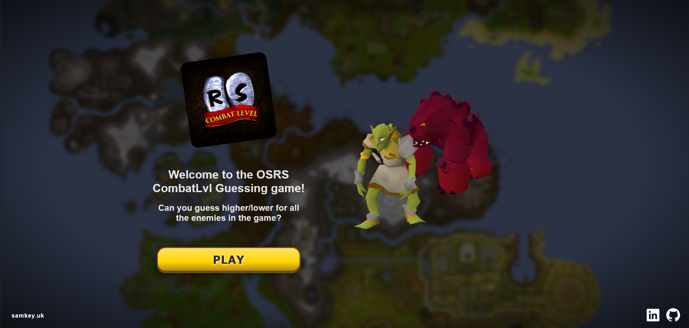
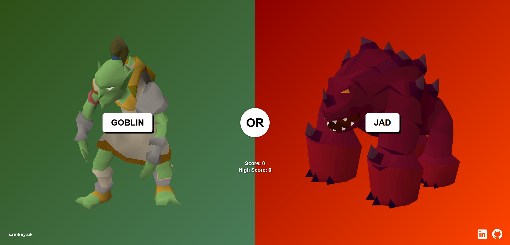

# MobHighLow - Docker Setup




This project contains both a backend Express.js API and a frontend Vite + React application, configured to run in Docker containers with hot reload enabled.

## Prerequisites

- Docker
- Docker Compose

## Quick Start

1. **Build and start the containers:**
   ```bash
   docker-compose up --build
   ```

2. **Access the applications:**
   - Frontend (React + Vite): http://localhost:5173
   - Backend (Express.js API): http://localhost:3000

3. **Stop the containers:**
   ```bash
   docker-compose down
   ```

## Development with Hot Reload

Both services are configured with hot reload enabled:

- **Backend**: Uses nodemon to automatically restart the server when files change
- **Frontend**: Uses Vite's built-in hot module replacement (HMR)

### Making Changes

1. Edit files in the `BACKEND/` or `FRONTEND/` directories
2. Changes will automatically trigger hot reload in the respective containers
3. No need to restart containers for code changes

## Container Management

### View logs
```bash
# All services
docker-compose logs

# Specific service
docker-compose logs backend
docker-compose logs frontend
```

### Rebuild containers
```bash
docker-compose up --build
```

### Stop and remove containers
```bash
docker-compose down
```

### Run in detached mode
```bash
docker-compose up -d
```

## API Endpoints

The backend API is available at `http://localhost:3000`:

- `GET /api/combat-level?mobName=<monster_name>` - Fetch combat level for a monster

## Project Structure

```
MobHighLow/
├── BACKEND/           # Express.js API
│   ├── index.js
│   ├── package.json
│   └── Dockerfile
├── FRONTEND/          # Vite + React app
│   ├── src/
│   ├── package.json
│   ├── vite.config.js
│   └── Dockerfile
├── docker-compose.yml # Multi-container orchestration
└── README.md
```

## Troubleshooting

### Port conflicts
If ports 3000 or 5173 are already in use, modify the port mappings in `docker-compose.yml`:

```yaml
ports:
  - "3001:3000"  # Map host port 3001 to container port 3000
```

### Permission issues
On Linux/macOS, you might need to run Docker commands with `sudo` or add your user to the docker group.

### Container not starting
Check the logs for specific error messages:
```bash
docker-compose logs <service-name>
``` 